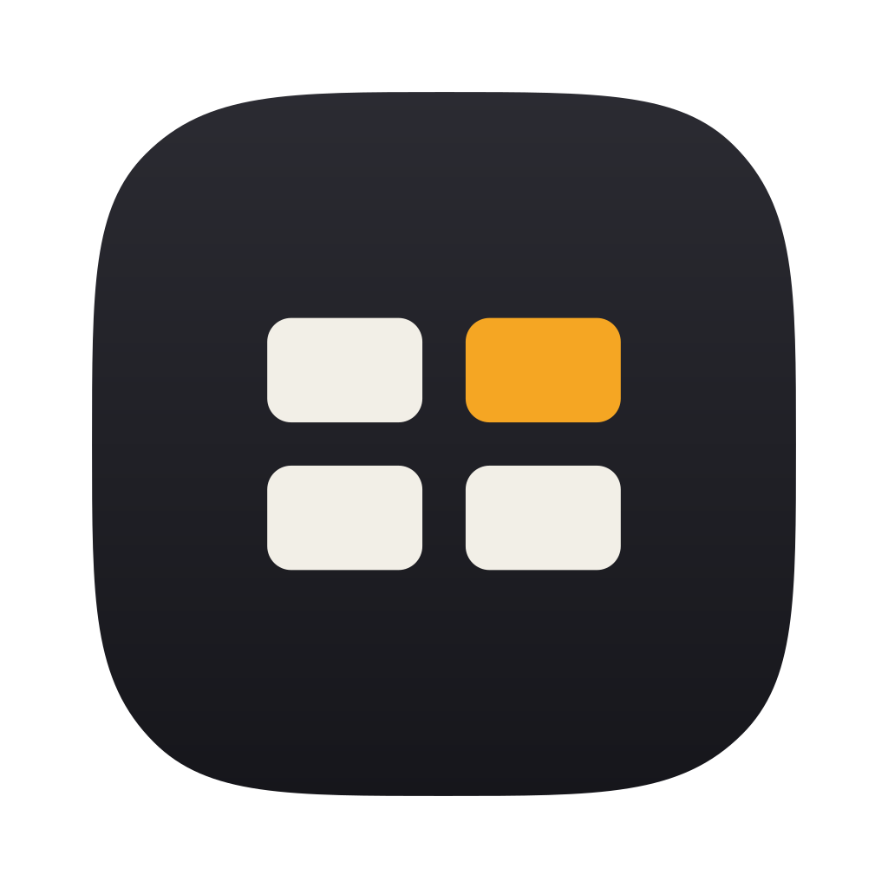

<p align="center">
  
</p>

<h1 align="center">dcs</h1>

<p align="center"><b>Digital Contact Sheet</b></p>

<p align="center">
  A fast, keyboard-first contact sheet for your photos. Scan, cull, tag, and
  export thousands of JPEGs without ever opening a heavy editor.
</p>

<p align="center">
  
  
</p>

> **Status:** alpha. Expect rough edges in the UI.

## What it does

You just got back from a trip with three thousand photos. You don't want to
edit them yet, you want to look through them, throw out the bad ones, keep the
good ones, and pull your favourites into a folder to share. That's the job dcs
does, and it does it fast. Originals are never touched; everything you do lives
in a small, readable project file next to your photos.

## Features

- **Native, cross-platform UI.** Runs on macOS, Linux, and Windows. The grid and
  gallery has been optimized for speed and low memory usage, even with thousands of photos.
- **Keyboard-first.** Accept, reject, tag, crop, search, undo, all on the
  keyboard and all remappable from a config file.
- **Non-destructive culling and tagging.** Accept / reject verdicts and tags
  persist between sessions; originals are never modified. A photo is identified
  by its content fingerprint, not its path, so it keeps its verdicts and tags
  even if you rename or move the file.
- **Crop and straighten.** Fixed ratios, free crop, and a straighten slider,
  applied as a clearable, non-destructive `CropEdit`.
- **Derived grouping.** Grouping, bursts, sort, and titles are recomputed from
  metadata, never persisted.
- **Local, offline AI search.** Free-text semantic search powered by an embedded
  SigLIP model. Fully on-device, no API, no upload. Off by default, enabled per
  project. See [Semantic search](#semantic-search).
- **Pure export planner.** All export logic (scope, layout, name templates,
  collision renaming) is pure and computed up front into a plan. Copy-only,
  never overwrites, the live preview is the plan that runs.
- **Durable, cross-session undo.** Every mutation is an entry in a persisted
  command log, so undo and redo still work after you close and reopen the app.

## Semantic search

Type what you're looking for ("temple", "red car", "people laughing") and dcs
returns the photos that match the meaning, not file names or tags.

It works by running a local [SigLIP](https://huggingface.co/google/siglip-base-patch16-384)
image-text model. Every photo and your query are turned into vectors in one
shared space; the matches are the photos nearest your query. The whole thing
runs **on your machine, fully offline**. No API, no account, nothing uploaded.

A few things worth knowing:

- **It's optional and per project.** Search is **off by default**. You turn it
  on for a given project, and that choice is saved with the project.
- **It needs to index first.** When enabled, dcs builds an index of your photos
  in the background, at the lowest priority, so it never slows down loading or
  scrolling. Search gets better as indexing finishes. The index is a disposable
  cache (about 3 KB per photo); it's never part of your owned project data.
- **Indexing can be GPU accellerated** Indexing and queries run on the GPU where available:
  Metal on macOS (on by default), CUDA on Nvidia, with a CPU fallback
  everywhere else. Queries are extremely fast (sub-100ms) even on CPU, expect slower indexing on CPU.
- **The model ships inside the app.** No separate download at runtime, it works
  out of the box. This is what makes the binary large (see below).

## Install

Grab a prebuilt binary from the
[Releases](https://github.com/paologaleotti/dcs/releases) page.

### Build & run

```sh
cargo build --workspace        # build everything
cargo run -p dcs-ui            # launch the app (binary name: dcs)
```

Release build:

```sh
cargo build --release -p dcs-ui --bin dcs
```

> **The first build downloads the search model (~800 MB, once).** `build.rs`
> fetches the pinned SigLIP model, checks its SHA-256, converts it to fp16, and
> bakes it into the binary. The embedded model adds about **390 MB** to the
> executable. It's cached per revision under `target/`, so only the first build,
> or a build after `cargo clean`, pays the download.

#### Prerequisites

- **Rust** stable (`rustup` recommended).
- **NASM** + **CMake**, because `turbojpeg` builds libjpeg-turbo's SIMD from
  source. CMake ships on most systems; install NASM through your package
  manager.
- **Linux only**, the GUI dev headers:
  ```sh
  sudo apt-get install -y libgtk-3-dev libxkbcommon-dev libwayland-dev \
    libx11-dev libxcursor-dev libxrandr-dev libxi-dev \
    libxcb1-dev libxcb-render0-dev libxcb-shape0-dev libxcb-xfixes0-dev pkg-config
  ```

#### GPU acceleration

Inference picks the best backend automatically, with a CPU fallback:

| Platform | Backend | How |
|---|---|---|
| macOS | **Metal** | automatic (on by default) |
| Linux / Windows + Nvidia | **CUDA** | `--features cuda` (needs the CUDA toolkit) |
| anything else | **CPU** | automatic fallback |

```sh
cargo build --release -p dcs-ui --bin dcs --features cuda    # Nvidia
```

#### Offline / air-gapped builds

Put the three files (`config.json`, `tokenizer.json`, `model.safetensors` from
the pinned revision) in a directory and point `build.rs` at it, with no
download:

```sh
DCS_MODEL_DIR=/path/to/model cargo build --release -p dcs-ui --bin dcs
```

To update the model, edit the pinned commit in
`crates/dcs-io/model_revision.txt` (read by both `build.rs` and CI). The next
build prints the new SHA-256 hashes; paste them into `crates/dcs-io/build.rs` to
lock them against drift.

## Test & lint

```sh
cargo fmt --all --check
cargo clippy --workspace -- -D warnings
cargo test --workspace
```

## Workspace layout

Four crates, dependencies pointing downward only:

| Crate | Role |
|---|---|
| `dcs-ui` | egui binary: grid / gallery / crop views, ephemeral UI state |
| `dcs-app` | conductor: session, command registry, dispatch, undo |
| `dcs-io` | infrastructure behind traits: imaging, scan, persistence, embeddings |
| `dcs-domain` | pure core: types and pure functions (no I/O, no async, no egui) |

The authoritative design lives in [`spec.md`](spec.md).

## Licensing

- **dcs** is licensed under **MIT OR Apache-2.0**, at your option.
- The embedded **SigLIP** model and tokenizer (`google/siglip-base-patch16-384`)
  are © Google, licensed under **Apache-2.0**. Because every build ships the
  model, distributions must include the model attribution and the Apache-2.0
  license text. See [`THIRD_PARTY_NOTICES.md`](THIRD_PARTY_NOTICES.md). The
  weights are converted to fp16 for embedding; no other change is made.
