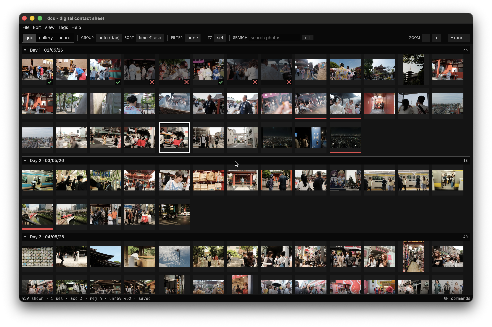
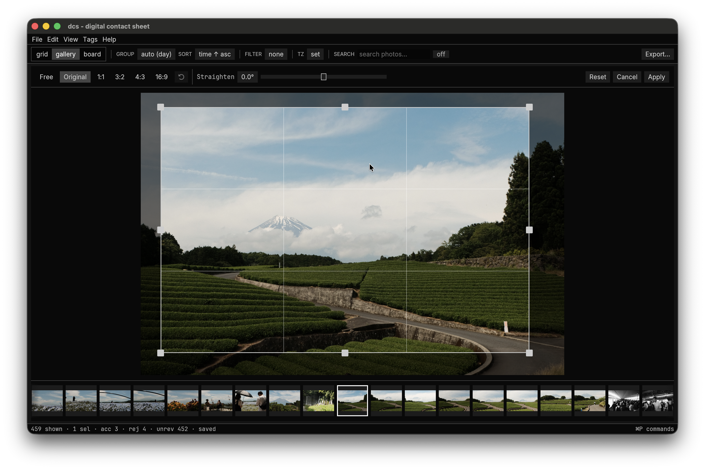

<p align="center">
  
</p>

<h1 align="center">dcs</h1>

<p align="center"><b>Digital Contact Sheet</b></p>

<p align="center">
  A fast, keyboard-first contact sheet for your photos. Scan, cull, tag, and
  export thousands of JPEGs without opening a heavy editor.
</p>

<p align="center">
  
  
</p>

> **Status:** alpha. Expect rough edges in the UI.

## What it does

You just got back from a trip with three thousand photos. You don't want to
edit them yet. You want to look through them, throw out the bad ones, keep the
good ones, and pull your favourites into a folder to share. That's the job dcs
does, and it does it fast. Originals are never touched; everything you do lives
in a small, readable project file next to your photos.

## Features

- **Fast and native.** Runs on macOS, Linux, and Windows, and stays smooth with
  thousands of photos.
- **Keyboard-first.** Accept, reject, tag, crop, search, and undo from the
  keyboard. Shortcuts are remappable.
- **Never touches your originals.** Verdicts and tags are saved alongside your
  photos, and stick even if you rename or move the files.
- **Crop and straighten** with fixed ratios, free crop, and a straighten slider.
- **Automatic grouping.** Photos organize themselves by day, time, and bursts.
- **Freeform board.** Drag photos onto a canvas and arrange them by hand.
- **Search by describing.** Find photos by what's in them ("temple", "red car"),
  entirely on your machine. See [Semantic search](#semantic-search).
- **Export your keepers** to a folder. Copies only, never overwrites.
- **Print contact sheets.** Turn your grid into a physical sheet on paper. See
  [Contact sheets](#contact-sheets).
- **Undo that lasts.** Undo and redo keep working after you close and reopen.

## Contact sheets

Make the *digital* contact sheet physical again: print your grid on paper.

Frames come out numbered in a film-rebate style with monospace captions, on the
paper size you choose (A4, A3, Letter, or Legal), against a black or white
background, with optional filename and exposure captions. Filters apply, so you
print exactly the set you're looking at, and the live preview is what gets
rendered. It saves to a multi-page PDF or prints straight through your system
viewer, so you can cull on paper the old-fashioned way, or show off a set you've
already picked.

## Semantic search

Type what you're looking for ("temple", "red car", "people laughing") and dcs
returns the photos that match the meaning, not file names or tags.

It works by running a local [SigLIP](https://huggingface.co/google/siglip-base-patch16-384)
image-text model. Every photo and your query are turned into vectors in one
shared space; the matches are the photos nearest your query. The whole thing
runs **on your machine, fully offline**. No API, no account, nothing uploaded.

A few things worth knowing:

- **It's optional and per project.** Search is **off by default**. You turn it
  on for a given project, and that choice is saved with the project.
- **It needs to index first.** When enabled, dcs builds an index of your photos
  in the background at the lowest priority, so it never slows down loading or
  scrolling. Search gets better as indexing finishes. The index is a disposable
  cache (about 3 KB per photo); it's never part of your owned project data.
- **Indexing is GPU-accelerated out of the box.** Inference runs on ONNX
  Runtime's WebGPU backend (Metal on macOS, DirectX 12 on Windows, Vulkan on
  Linux), so any GPU from any vendor accelerates it with nothing to install.
  Without a usable GPU it falls back to the CPU: queries stay fast (sub-100ms),
  indexing gets slower.
- **The model ships inside the app.** No separate download at runtime, so it
  works out of the box. This is what makes the binary large (see below).
- **Not available on Intel Macs.** ONNX Runtime (and Microsoft upstream)
  [dropped prebuilt libraries for macOS x86_64](https://github.com/pykeio/ort/issues/556),
  so the Intel build ships without AI search; those artifacts are tagged
  `no-aisearch`. Everything else works normally.

## Install

Grab a prebuilt binary from the
[Releases](https://github.com/paologaleotti/dcs/releases) page.

### Build & run

```sh
cargo build --workspace        # build everything
cargo run -p dcs-ui            # launch the app (binary name: dcs)
```

Release build:

```sh
cargo build --release -p dcs-ui --bin dcs
```

> **The first build downloads the search model (~410 MB, once).** `build.rs`
> fetches the pinned SigLIP ONNX model, checks its SHA-256, and bakes it into
> the binary, adding about **390 MB** to the executable. It's cached per
> revision under `target/`, so only the first build (or a build after
> `cargo clean`) pays the download. (`ort` also fetches its prebuilt ONNX
> Runtime once per version, cached the same way.)

#### Prerequisites

- **Rust** stable (`rustup` recommended).
- **NASM** and **CMake**, because `turbojpeg` builds libjpeg-turbo's SIMD from
  source. CMake ships on most systems; install NASM through your package
  manager.
- **Linux only**, the GUI dev headers:
  ```sh
  sudo apt-get install -y libgtk-3-dev libxkbcommon-dev libwayland-dev \
    libx11-dev libxcursor-dev libxrandr-dev libxi-dev \
    libxcb1-dev libxcb-render0-dev libxcb-shape0-dev libxcb-xfixes0-dev pkg-config
  ```

#### GPU acceleration

One backend everywhere: ONNX Runtime's **WebGPU** execution provider drives the
GPU through Metal (macOS), DirectX 12 (Windows), or Vulkan (Linux). Every
vendor works, nothing to install, and it falls back to CPU when no usable GPU
exists. The provider lives in a small shared library (`libwebgpu_dawn`) that
must sit next to the binary; cargo places it there automatically, and the
release packages ship it. (When packaging locally with `cargo packager`, run
from the workspace root and stage that library into `target/webgpu-dist`
first; a package without it fails at launch.)

The prebuilt ONNX Runtime sets the platform floors for AI builds: macOS 13.4+,
Windows 10 1903+, and Linux with glibc 2.38+ (Ubuntu 24.04, Debian 13, Fedora
39 or newer). The macOS Intel build has no such floor since it ships without
the runtime.

AI search is a default-on cargo feature. `--no-default-features` builds a
search-less binary: the app works normally and the search UI reports that AI
search is not included. Release CI uses this for macOS Intel, where ONNX
Runtime ships no prebuilt libraries
([dropped upstream](https://github.com/pykeio/ort/issues/556)); those
artifacts are tagged `no-aisearch`.

#### Offline / air-gapped builds

Put the four files from the pinned revision (`config.json`, `tokenizer.json`,
plus `vision_model_fp16.onnx` and `text_model_fp16.onnx` flattened out of the
repo's `onnx/` folder) in a directory and point `build.rs` at it, with no
download:

```sh
DCS_MODEL_DIR=/path/to/model cargo build --release -p dcs-ui --bin dcs
```

To update the model, edit the pinned commit in
`crates/dcs-io/model_revision.txt` (read by both `build.rs` and CI). The next
build prints the new SHA-256 hashes; paste them into `crates/dcs-io/build.rs` to
lock them against drift.

## Test & lint

```sh
cargo fmt --all --check
cargo clippy --workspace -- -D warnings
cargo test --workspace
```

## Workspace layout

Four crates, dependencies pointing downward only:

| Crate | Role |
|---|---|
| `dcs-ui` | egui binary: grid / gallery / crop / board views, contact-sheet dialog, ephemeral UI state |
| `dcs-app` | conductor: session, command registry, dispatch, undo |
| `dcs-io` | infrastructure behind traits: imaging, scan, persistence, embeddings |
| `dcs-domain` | pure core: types and pure functions (no I/O, no async, no egui) |

The authoritative design lives in [`spec.md`](spec.md).

## Licensing

- **dcs** is licensed under **MIT OR Apache-2.0**, at your option.
- The embedded **SigLIP** model and tokenizer are © Google, licensed under
  **Apache-2.0** (weights from `google/siglip-base-patch16-384`, embedded as the
  fp16 ONNX export published at `Xenova/siglip-base-patch16-384`). Because every
  build ships the model, distributions must include the model attribution and
  the Apache-2.0 license text. See
  [`THIRD_PARTY_NOTICES.md`](THIRD_PARTY_NOTICES.md).
- **ONNX Runtime** (© Microsoft, MIT) is statically linked, and its WebGPU
  support library (`libwebgpu_dawn`, BSD-3-Clause Dawn) ships next to the
  binary.
